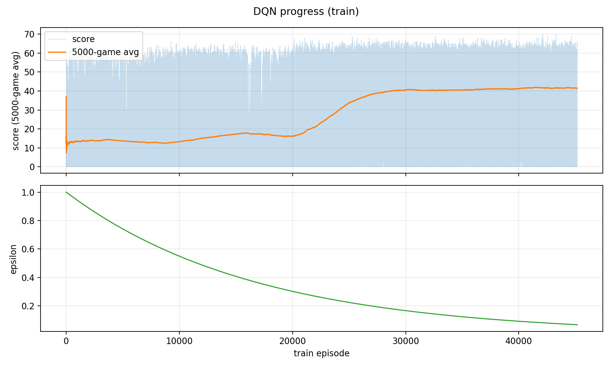

# Pygame DoodleJump
Pygame DoodleJump clone with an added Deep Q-Learning agent. The project can run the original visual game loop, train a DQN agent from game-state observations, save checkpoints, and replay a trained checkpoint in inference mode.


```text
The agent found a weird stra where he will spam right.
This indeed seems to work for him.
```

## General Info
* No images used for graphics
* RL state includes player motion and nearby platform offsets

## Credits
Game copied from [MykleR/Pygame-DoodleJump](https://github.com/MykleR/Pygame-DoodleJump)

## Setup
```bash
pip install -r requirements.txt
# Run the training loop:
python main.py
```

## Headless training for servers:

```bash
HEADLESS=1 python main.py
```

In non-headless mode, the trainer can show visual evaluation episodes after each training block. The default is:

```text
HEADLESS=0 -> 3 eval episodes
HEADLESS=1 -> 0 eval episodes
```


Set checkpoints:

```bash
HEADLESS=1 TRAIN_EPISODES_PER_CHECKPOINT=5000 python main.py
-> dqn_checkpoint.pth
```
If this file exists, `main.py` loads it automatically on startup and continues training from it.

## Inference
Run a trained checkpoint without learning or exploration:

```bash
python inference.py --checkpoint dqn_checkpoint.pth --episodes 3
# or use eval while training
EVAL_EPISODES=5 
# disable it 
EVAL_EPISODES=0 python main.py
```

## Architecure: Deep Q Learning Algorithm

Each single-frame state has 12 values:

- Player center X, normalized by window width.
- Player screen-relative center Y, normalized by window height.
- Player horizontal velocity, normalized by `PLAYER_MAX_SPEED`.
- Player vertical velocity, normalized by `PLAYER_MAX_SPEED`.
- Four nearby platforms. For each platform:
  - Horizontal distance from the player, normalized by window width.
  - Vertical distance from the player, normalized by window height.

**actions**: 0(do nothing), 1 (move left), 2 (move right)
**frame stacking** We stack 16 frames of history for context.
**frame skipping** The model receives every 4th simulated frame, not every consecutive frame

At `FPS = 60`, the 16-frame stack covers:

- 16 stacked observations * 4 simulated frames = 64 simulated frames
- 64 / 60 FPS = about 1.07 seconds of history

### Model
```python
class DQN(nn.Module):
    def __init__(self, state_size=STATE_SIZE, action_size=3):
        super().__init__()

        self.net = nn.Sequential(
            nn.Linear(state_size, 128),
            nn.ReLU(),

            nn.Linear(128, 128),
            nn.ReLU(),

            nn.Linear(128, action_size)
        )

    def forward(self, x):
        return self.net(x)
```

### Rewards
I experimented with diffrent reward shaping options
1. only score as reward
2. dying gives punishment (-100)
3. getting stuck punishment
4. reward for increasing distance
5. small reward for surviving


# results & conclusion
- about 8 hours on a rundpod cpu pod.


#### Altho it did improve Definitly could be better in my opinion
I will try a recurrent network next.